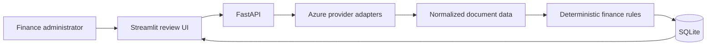

# Target architecture

Document Review System is a small local full-stack application. The starter intentionally contains only a FastAPI health endpoint and an empty Streamlit app.

## Intended boundaries

- Provider adapters normalize Azure responses before data reaches the domain.
- Deterministic invoice and receipt rules remain separate from model extraction.
- Routes own HTTP concerns, a service owns orchestration, and a repository owns SQLite access.
- Environment values are read through one backend settings module and one Streamlit environment module.
- A person approves, rejects, or requests a supplier correction after seeing evidence and uncertainty.

## Target flow

## Starter checkpoint

The backend exposes `GET /health`, the Streamlit app has no pages yet, the fictional corpus is available under `samples/`, and no completed review workflow exists yet. `TODOS.md` is the build sequence from here.
